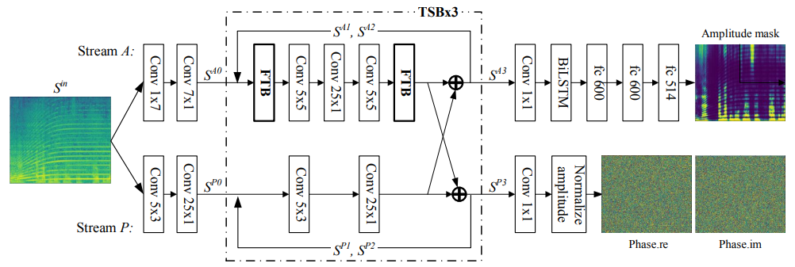
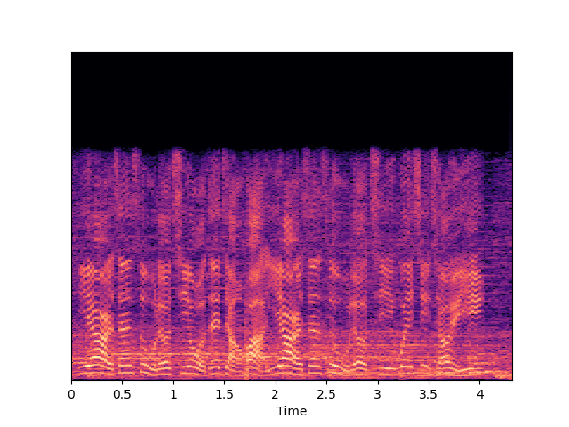
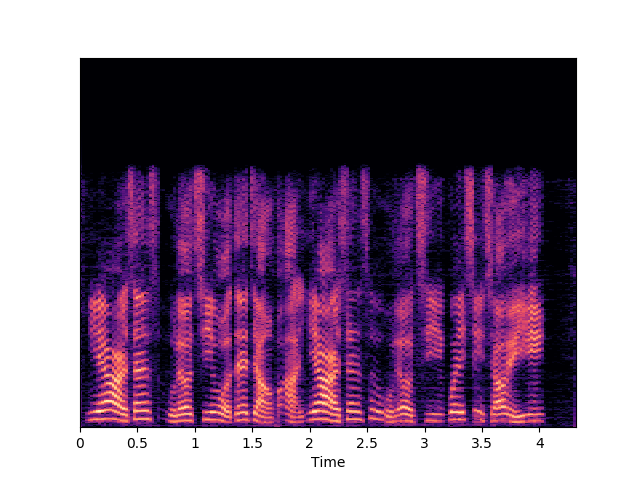

# PHASEN

---
Unofficial PyTorch implementation of MSRA's:
    [PHASEN: A Phase-and-Harmonics-Aware Speech Enhancement Network](https://arxiv.org/abs/1911.04697).
 

---

## My resutls on real-world test



May be there is something different with the paper, but it worked not bad.

---

## how to use it?
1. install dependency:
```bash
pip install -r requirements.txt

```
2. download datasets 
if you don't have WSJ0, you can follow this use aishell-1 by following this [se-cldnn-torch](https://github.com/huyanxin/se-cldnn-torch) 

3. run.
before you run it, please set the correct params in `./run_phasen.sh`
```bash
bash run_phasen.sh
```

## Reference:
funcwj's [voice-filter](https://github.com/funcwj/voice-filter)

wangkenpu's [Conv-Tasnet](https://github.com/wangkenpu/Conv-TasNet-PyTorch)

pseeth's [torch-stft](https://github.com/pseeth/torch-stft)
